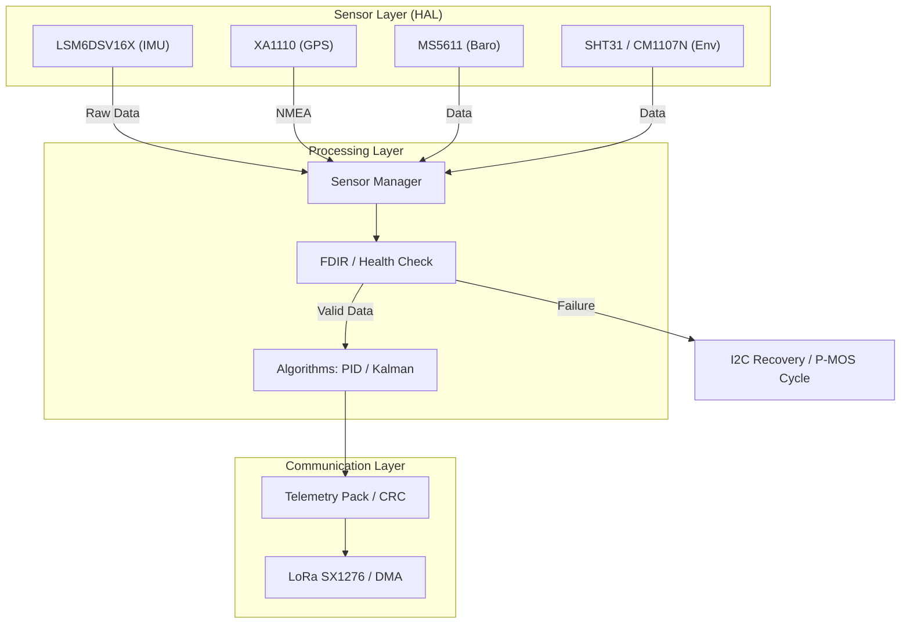

# STM32 Space Balloon Radiosonde

고고도 기상관측용 라디오존데 펌웨어 - STM32G431CBU6 기반


---

## 📋 목차

- [개요](#-개요)
- [개발 환경](#-개발-환경)
- [품질 및 신뢰성 검증](#-품질-및-신뢰성-검증-)
- [하드웨어 구성](#-하드웨어-구성)
- [프로젝트 구조](#-프로젝트-구조)
- [빌드 및 테스트](#-빌드-및-테스트)
- [문서 허브](#-문서-허브)
- [라이선스](#-라이선스)

---

## 🎈 개요

이 프로젝트는 고고도 기구(HAB: High Altitude Balloon)에 탑재되는 라디오존데 시스템입니다.

### 🏗️ 시스템 아키텍처



**주요 특징:**

- **고신뢰성 아키텍처**: 50Hz 결정론적 Super Loop 및 4단계 FDIR(고장 복구) 시스템
- **Renode (v1.15.3)**: FDIR HIL 시뮬레이션 및 검증
- **Cppcheck (v2.13.0)**: 정적 분석(Gate 2) 자동화
- **ESP-IDF (v5.5.1)**: 텔레메트리 수신기(ESP32) 개발 환경
- **데이터 융합**: Kalman 필터 기반 고도/자세 추정 및 11종 센서 데이터 통합
- **검증 환경**: gcov 유닛 테스트, SITL(Host) 및 HITL(Hardware-in-the-Loop) 시뮬레이션 지원
- **실시간 전송**: LoRa 기반 고밀도 텔레메트리 프로토콜 (CRC-16 검증)

---

## 💻 개발 환경

### IDE / 에디터

| 도구 | 버전 | 용도 |
| :--- | :--- | :--- |
| **VS Code** | 1.96+ | 메인 개발 환경 |
| **STM32CubeMX** | 6.x | 핀 설정 및 코드 생성 |
| **STM32CubeIDE** | 1.x | (선택) CubeMX 통합 IDE |

### VS Code 확장

| 확장 | 설명 |
| :--- | :--- |
| **CMake Tools** | CMake 빌드 시스템 지원 |
| **Cortex-Debug** | ARM Cortex-M 디버깅 |
| **C/C++** (Microsoft) | IntelliSense 및 코드 탐색 |
| **clangd** | 코드 분석 및 자동완성 |

### 툴체인 / 빌드 도구

| 도구 | 버전 | 용도 |
| :--- | :--- | :--- |
| **ARM GCC** | 13.x+ | 크로스 컴파일러 (arm-none-eabi-gcc) |
| **MSYS2 / MinGW** | 15.x | 호스트 테스트 (gcov, gcc) |
| **CMake** | 3.20+ | 빌드 구성 도구 |
| **OpenOCD** | 0.12+ | 플래시/디버깅 |

### 🚀 통합 개발 환경 (Quick Setup)

모든 개발 도구가 포함된 **통합 Docker 환경** 사용을 권장합니다.

```bash
# 1. 이미지 빌드 및 실행 (프로젝트 루트에서)
chmod +x docker/build_docker.sh
./docker/build_docker.sh

# 2. 컨테이너 접속
docker run -it --rm --privileged -v $(pwd):/workspace space-balloon-dev:latest bash
```

Docker 없이 로컬(Windows)에서 직접 구성할 경우:
```powershell
# Scoop을 이용한 원클릭 환경 구성
scoop install gcc arm-none-eabi-gcc cmake make openocd python
```

---

## 🛡️ 품질 및 신뢰성 검증 

이 프로젝트는 극한 환경인 성층권 비행을 위해 엄격한 소프트웨어 품질 검증 과정을 거칩니다.


- **MISRA C:2023**: 필수 및 권고 가이드라인 준수 (안전성 및 이식성 강화)
- **정적 분석 (Cppcheck)**: `Error: 0`, `Warning: 0` 달성 (Gate 2 통과)
- **유닛 테스트 (gcov)**: 핵심 알고리즘(PID, Kalman) 커버리지 **89%** 달성 (Gate 3 통과)
- **FDIR 검증**: Renode 시뮬레이션을 통해 22개 고장 시나리오 100% 복구 확인

> 상세 리포트는 **[docs/README.md](./docs/README.md)**에서 확인할 수 있습니다.

---

## 🔧 하드웨어 구성

| 구분 | 센서/모듈 | 인터페이스 | 용도 |
| :--- | :--- | :--- | :--- |
| MCU | STM32G431CBU6 | - | 메인 프로세서 |
| IMU | LSM6DSV16X | I2C1 | 가속도/자이로 |
| Mag | MLX90393 | I2C1 | 자기장 |
| Baro | MS5611 | I2C3 | 기압/온도 |
| Temp/Hum | SHT31-D | I2C3 | 온습도 |
| GPS | XA1110 | UART1 | 위치/고도 |
| Radiation | GDK101 | I2C1 | 방사선량 |
| CO2 | CM1107N | I2C3 | CO2 농도 (UART→I2C3 변경) |
| Ozone | SEN0321 | I2C3 | 오존 농도 |
| PM | PMS3003 | UART3 | 미세먼지 |
| Thermo | MCP9600 | I2C3 | 외부 온도 |
| 1-Wire | DS18B20 x2 | GPIO | 보드/배터리 온도 |

---

## 📁 프로젝트 구조

```text
stm32_spaceballoon/
├── docker/                     # [NEW] 통합 Docker 개발 환경 (Dockerfile, scripts)
├── stm32cube/                  # STM32 Bare-metal 앱 (기존 메인)
│   ├── Core/                   # Inc/Src/Drivers (센서 알고리즘 및 드라이버)
│   │   ├── Inc/                    # 헤더 파일
│   │   │   ├── app.h
│   │   │   ├── sensors.h
│   │   │   ├── telemetry.h
│   │   │   ├── kalman.h
│   │   │   ├── pid.h
│   │   │   └── fdir.h
│   │   ├── Src/                    # 소스 파일
│   │   │   ├── app.c               # 메인 애플리케이션 로직
│   │   │   ├── sensors.c           # 센서 드라이버 통합
│   │   │   ├── telemetry.c         # 텔레메트리 패킹/CRC
│   │   │   ├── kalman.c            # Kalman 필터
│   │   │   ├── pid.c               # PID 제어기
│   │   │   └── fdir.c              # 오류 감지/복구
│   │   └── Drivers/                # 개별 센서 드라이버
│   │       ├── lsm6dsv16x/
│   │       ├── mlx90393/
│   │       ├── ms5611/
│   │       └── ...
│   └── Drivers/                # HAL/CMSIS 드라이버
├── zephyrRTOS/                 # Zephyr RTOS 포팅 작업용 폴더
│   └── zephyr_app/             # Zephyr 기반 애플리케이션
├── RENODE_TEST(HIL)/           # Renode 시뮬레이션 환경 (HIL/SITL)
│   ├── renode/                 # Renode 플랫폼 및 스크립트
│   ├── run_fdir_tests.py       # 자동화된 FDIR 테스트 러너
│   └── results/                # 테스트 결과 및 리포트
├── SITL/                       # Software-In-The-Loop 시뮬레이션
│   ├── HostSim/                # 호스트 PC 시뮬레이션 (C 언어 스텁)
│   ├── test/                   # 알고리즘 유닛 테스트 (Kalman, PID 등)
│   ├── simulation_reference_data/ # 실제 비행 데이터 (RS41)
│   ├── build_host/             # HostSim 빌드 결과물
│   └── build_test/             # Unit Test 빌드 결과물
├── HITL/                       # Hardware-In-The-Loop 시나리오 및 대시보드
├── telemetry/                  # ESP32 기반 원격 수신기 (IDF)
├── docs/                       # 설계 및 분석 문서
├── cmake/                      # 툴체인 설정
│   └── gcc-arm-none-eabi.cmake # 툴체인 설정
├── CMakeLists.txt              # 메인 빌드 설정
├── CMakePresets.json           # Debug/Release 프리셋
└── stm32_spaceballoon.ioc      # CubeMX 설정
```

---

## 🛠 빌드 방법

### 요구사항

- **Docker (권장)**: 모든 도구가 포함된 일관된 환경 제공
- **로컬 빌드**: ARM GCC Toolchain, cube-cmake, OpenOCD, Python 3.x

### 실제 하드웨어 빌드 (Docker 사용 시)
```bash
# 1. 컨테이너 접속
docker exec -it space-balloon-dev bash

# 2. STM32Cube 빌드
cd /workspace/stm32cube
mkdir build && cd build
cmake .. && make
```

### 실제 하드웨어 빌드 (로컬 사용 시)

```powershell
# 1. Debug 프리셋 선택 (VS Code에서)
# Ctrl+Shift+P → CMake: Select Configure Preset → Debug

# 2. 빌드
cube-cmake --build build/Debug

# 3. 플래시
openocd -f interface/stlink.cfg -f target/stm32g4x.cfg -c "program build/Debug/stm32_spaceballoon.elf verify reset exit"
```

### 호스트 및 유닛 테스트 빌드

알고리즘 검증 및 커버리지 측정을 위해 MSYS2/MinGW 환경에서 빌드합니다.

```bash
# 1. build_host 디렉토리 생성
mkdir build_host && cd build_host

# 2. CMake 설정 (MSYS2 터미널 권장)
cmake -G "MinGW Makefiles" ../gcov_test_host

# 3. 빌드 및 테스트 실행
mingw32-make
./host_test_runner.exe

# 4. 커버리지 측정 (gcov)
gcov -b *.gcda
```

> [!TIP]
> 상세 지침은 **[gcov_test_host/README.md](./gcov_test_host/README.md)**를 참조하세요.

---

## 📚 문서 허브

프로젝트에 대한 모든 상세 문서는 **[docs/README.md](./docs/README.md)**를 통해 체계적으로 접근할 수 있습니다.

- **[최종 보고서](./docs/FINAL_REPORT.md)**: 시스템 설계 및 검증 요약 (Rev 5.0)
- **[품질 검증 리포트](./docs/cppcheck%20&%20gcov%20report/README.md)**: MISRA/Cppcheck/gcov 상세 결과
- **[FDIR 설계](./docs/FDIR.md)** / **[FMEA 분석](./docs/FMEA.md)**: 고장 복구 및 위험 분석
- **[기능 명세서](./docs/STM32_SpaceBalloon_Specification.md)**: 상세 하드웨어/소프트웨어 사양

---

## 🧪 테스트 및 실행

이 프로젝트는 다단계 검증 체계를 갖추고 있습니다.

1. **유닛 테스트 (Algorithm Logic)**: `SITL/test`를 통한 PID/Kalman 로직 검증.
2. **SITL (Software-In-The-Loop)**: `SITL/HostSim`을 통한 실제 비행 데이터(RS41) 재생 테스트.
3. **HITL (Hardware-In-The-Loop)**: 실제 STM32 보드와 센서 에뮬레이터를 연결한 통합 테스트.
4. **FDIR 시뮬레이션**: Renode 환경에서의 22가지 장애 주입 테스트.

> 각 테스트의 상세 방법은 관련 디렉토리의 README를 참조하세요.

---

## 🚀 추가 검증 환경

### HITL 시뮬레이션
**HITL (Hardware-In-The-Loop)** 테스트를 통해 실제 STM32와 ESP32 Mock 보드를 연결하여 비행 시나리오를 검증합니다. [HITL/README.md](HITL/README.md) 참조.

### Renode FDIR 시뮬레이션
**Renode**를 사용하여 하드웨어 없이 펌웨어의 전체 로직과 FDIR(장애 감지 및 복구) 기능을 시뮬레이션합니다. [RENODE_TEST(HIL)/results/README.md](RENODE_TEST(HIL)/results/README.md) 참조.

---

## 📡 텔레메트리 프로토콜

### 프레임 크기
| 구성 요소 | 크기 |
|----------|------|
| **페이로드** | 116 바이트 |
| **헤더** | 12 바이트 |
| **CRC** | 2 바이트 |
| **전체 프레임** | **130 바이트** |

### 프레임 및 페이로드 구조 (C Struct)

`Core/Inc/telemetry.h`에 정의된 패킷 구조체입니다. (`#pragma pack(1)` 적용됨)

```c
// 1. 센서 스냅샷 페이로드
typedef struct {
    /* 1. System Status */
    uint32_t uptime_ms;
    uint16_t status_flags;
    uint16_t co2_ppm;           /* CM1107N */

    /* 2. IMU (LSM6DSV16X) (x1000 scaled) */
    int32_t accel_mps2_x1000[3];
    int32_t gyro_rads_x1000[3];

    /* 3. Magnetometer (MLX90393) */
    float mag_uT[3];

    /* 4. Temperature (x100 scaled) */
    int16_t board_temp_c_x100;      /* DS18B20 (Board) */
    int16_t external_temp_c_x100;   /* MCP9600 */
    int16_t sht31_temp_c_x100;      /* SHT31 */

    /* 5. Reserved / Extended Status */
    int16_t bat_temp_c_x100;        /* DS18B20 (Battery) */

    /* 6. GPS (XA1110) (x10^7 scaled for lat/lon) */
    int32_t gps_lat_deg_e7;
    int32_t gps_lon_deg_e7;
    float gps_alt_m;
    uint8_t gps_fix;
    uint8_t gps_sats_used;
    uint8_t gps_sats_in_view_total;
    uint8_t gps_sats_in_view_gps;
    uint8_t gps_sats_in_view_glonass;
    uint8_t gps_sats_in_view_galileo;
    uint8_t gps_sats_in_view_beidou;
    
    /* GPS UTC Time (from RMC sentence) */
    uint8_t gps_utc_hour;
    uint8_t gps_utc_min;
    uint8_t gps_utc_sec;
    uint8_t gps_utc_day;
    uint8_t gps_utc_month;
    uint16_t gps_utc_year;

    uint16_t bat_mv;            /* ADC PA1 */

    /* 7. Air Quality */
    uint16_t pm1_ugm3;          /* PMS3003 */
    uint16_t pm25_ugm3;
    uint16_t pm10_ugm3;
    int16_t ozone_ppb;          /* SEN0321 */

    /* 8. Pressure / Humidity */
    uint16_t sht31_rh_x100;     /* SHT31 */
    uint32_t ms5611_press_pa;   /* MS5611 */
    int16_t ms5611_temp_c_x100;

    /* 9. Radiation */
    uint16_t gdk101_usvh_x100;  /* GDK101 */

    /* 10. Heater Status */
    uint8_t heater_bat_duty_percent;
    uint8_t heater_board_duty_percent;

    /* 11. Altitude Fusion */
    float press_alt_m;
    float kf_alt_m;
    float kf_roll_deg;
    float kf_pitch_deg;

} telemetry_payload_sensor_snapshot_t;

// 2. 전체 전송 프레임 (Header + Payload + CRC)
typedef struct {
    uint8_t magic[2];      /* {0xA5, 0x5A} */
    uint8_t version;       /* 1 */
    uint8_t msg_type;      /* 0x01 heartbeat, 0x02 sensor snapshot */
    uint16_t payload_len;  /* bytes */
    uint16_t seq;
    uint32_t timestamp_ms;
    telemetry_payload_sensor_snapshot_t payload;
    uint16_t crc16;        /* CRC-16/CCITT-FALSE over header+payload */
} telemetry_frame_t;
```

### 페이로드 상세 항목 (참고)
---

## 🌡 센서 목록

| ID | 센서 | 측정값 | 샘플링 |
| :--- | :--- | :--- | :--- |
| 0 | LSM6DSV16X | 가속도, 자이로 | 480Hz |
| 1 | MLX90393 | 자기장 X/Y/Z | 50Hz |
| 2 | MS5611 | 기압, 온도 | 5Hz |
| 3 | SHT31-D | 온도, 습도 | 1Hz |
| 4 | XA1110 | GPS 위치 | 1Hz |
| 5 | GDK101 | 방사선량 | 1Hz |
| 6 | CM1107N | CO2 | 1Hz (I2C3) |
| 7 | SEN0321 | 오존 | 1Hz |
| 8 | PMS3003 | 미세먼지 | 1Hz |
| 9 | MCP9600 | 열전대 온도 | 1Hz |
| 10 | DS18B20 | 1-Wire 온도 | 1Hz |

---

## 📄 라이선스

MIT License

---

## 🙏 감사의 글

- RS41 라디오존데 데이터: [SondeHub](https://sondehub.org/)
- STM32 HAL: STMicroelectronics
- LSM6DSV16X 드라이버: ST MEMS Drivers

---

**마지막 업데이트:** 2026-03-01
